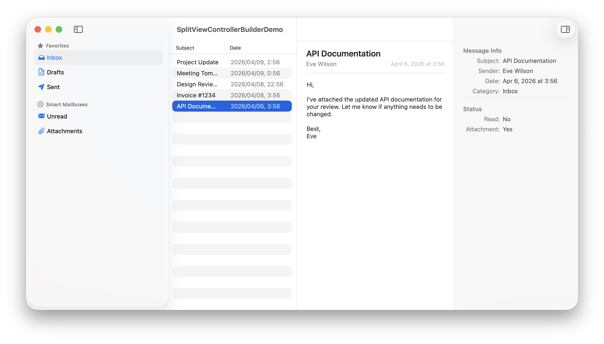

# SplitViewControllerBuilder

[日本語](README_ja.md)

A Swift Package for building `NSSplitViewController` layouts on macOS.
Define sidebar, content list, content area, and inspector panes through extensions on `NSSplitViewController`.




## Requirements

- macOS 11+
- Swift 6


## Installation

Add the package via Swift Package Manager:

```swift
dependencies: [
    .package(url: "https://github.com/usagimaru/SplitViewControllerBuilder.git", from: "0.1.0")
]
```

Then import it:

```swift
import SplitViewControllerBuilder
```


## Usage


### Building a Split View Controller

Use the `build()` factory method and add panes with dedicated methods. Each method returns the `NSSplitViewItem` for further customization.

```swift
let splitViewController = NSSplitViewController.build()

splitViewController.addSidebar(sidebarVC)
splitViewController.addContentList(contentListVC)
splitViewController.addContentArea(detailVC)
splitViewController.addInspector(inspectorVC)
```

- `addSidebar(_:)` — Adds a sidebar pane at index 0.
- `addContentList(_:)` — Adds a content list pane after the sidebar (or at index 0 if no sidebar exists).
- `addContentArea(_:behavior:)` — Adds a content area before the inspector (or at the end). Defaults to `.default` behavior.
- `addInspector(_:)` — Adds an inspector pane at the end.

All methods are marked `@discardableResult` and return `NSSplitViewItem`, so you can chain property customizations:

```swift
splitViewController.addContentArea(detailVC).holdingPriority = .defaultLow
```


### Pane Behaviors

Each add method internally creates an `NSSplitViewItem` with the appropriate behavior and configuration:

| Method | Behavior | Configuration |
|--------|----------|---------------|
| `addSidebar` | `.sidebar` | Full-height layout, minimum thickness |
| `addContentList` | `.contentList` | Full-height layout, minimum thickness |
| `addContentArea` | `.default` | Bare item (customizable via returned item) |
| `addInspector` | `.inspector` | Full-height layout |


### Customizing Classes

You can pass custom `NSSplitView` and `NSSplitViewItem` subclasses:

```swift
// Custom NSSplitView subclass
let splitViewController = NSSplitViewController.build(splitViewClass: MySplitView.self)

// Custom NSSplitViewItem subclass per pane
splitViewController.addSidebar(sidebarVC, splitViewItemClass: MySplitViewItem.self)
```

By default, `build()` uses `SplitView` (which provides custom animation support for divider positions) and each add method uses `SplitViewItem` (which provides custom collapse animation).


### Accessing Split View Items

```swift
// Get all items matching a specific behavior
let sidebars = splitViewController.splitViewItems(for: .sidebar)

// Get the first item matching a specific behavior
let inspector = splitViewController.firstSplitViewItem(for: .inspector)

// Get the first item by view controller class
let item = splitViewController.firstItemForViewControllerClass(MyViewController.self)

// Type-safe access by view controller class
let pane: NSSplitViewController.SplitItemInfo<MyViewController>? = splitViewController.firstPane()
```

`SplitItemInfo<T>` provides the item index, the `NSSplitViewItem`, and the typed view controller together.


### Toggling Collapsed State

`NSSplitViewItem` extensions provide animated collapse toggling:

```swift
// Toggle with animation
item.toggleCollapsed(animated: true)

// Set a specific state, or pass nil to toggle
item.setCollapsed(true, animated: true)
```

Both methods automatically respect the **Reduce Motion** accessibility setting.


## License

See [LICENSE](./LICENSE) for details.
